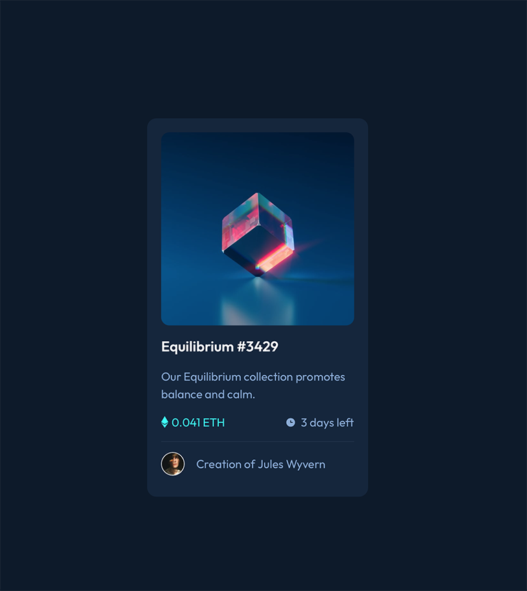

# Frontend Mentor - NFT preview card component solution

This is a solution to the [NFT preview card component challenge on Frontend Mentor](https://www.frontendmentor.io/challenges/nft-preview-card-component-SbdUL_w0U). Frontend Mentor challenges help you improve your coding skills by building realistic projects.

## Table of contents

- [Overview](#overview)
  - [The challenge](#the-challenge)
  - [Screenshot](#screenshot)
  - [Links](#links)
- [My process](#my-process)
  - [Built with](#built-with)
  - [Useful resources](#useful-resources)
- [Author](#author)

## Overview

### The challenge

Users should be able to:

- View the optimal layout depending on their device's screen size
- See hover states for interactive elements

### Screenshot

### Links

- Solution URL: [https://github.com/peanutbutterjlly/frontEndMentorChallenge/tree/main/nft-preview-card-component-main](https://github.com/peanutbutterjlly/frontEndMentorChallenge/tree/main/nft-preview-card-component-main)
- Live Site URL: [https://front-end-mentor-challenge-xtfu.vercel.app](https://front-end-mentor-challenge-xtfu.vercel.app)

## My process

### Built with

- Semantic HTML5 markup
- CSS custom properties
- Flexbox
- CSS Grid

## Author

- Website - [Steve Rios](https://www.github.com/peanutbutterjlly)
- Frontend Mentor - [@peanutbutterjlly](https://www.frontendmentor.io/profile/peanutbutterjlly)
- Twitter - [@steve_developr](https://www.twitter.com/steve_developr)
